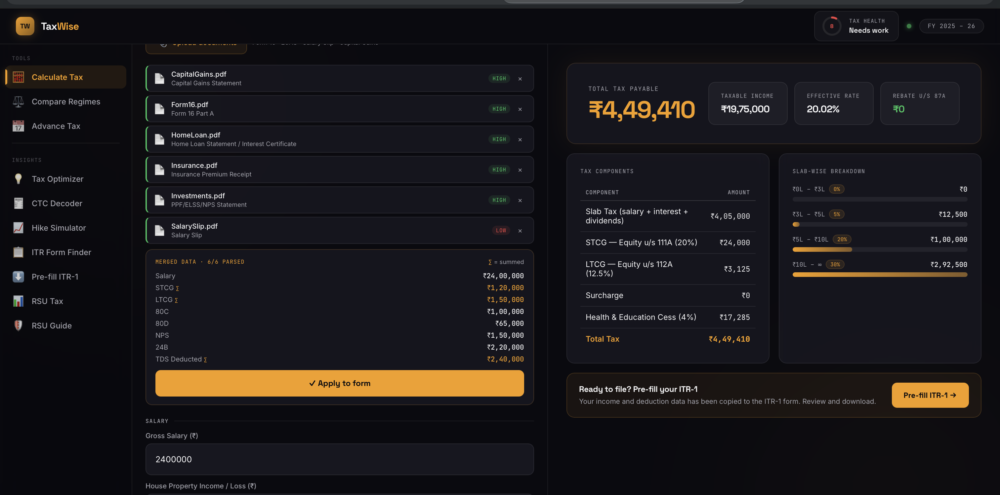

<div align="center">


# TaxWise

### Indian Income Tax Calculator for FY 2025–26

**The only tax tool built for tech professionals — RSU guide, Form 16 upload, layoff simulator, AI tax advisor, and pre-filled ITR-1. Free, no login.**

[**→ Open TaxWise**](https://taxwise-one.vercel.app)

</div>

---

## Who is this for?

| | |
|---|---|
| **RSU / ESOP holders** | Full RSU guide + calculator: perquisite tax at vesting, capital gains at sale, DTAA credit, Schedule FA, Form 67 — everything in one place |
| **Tech employees facing a layoff** | Layoff simulator: enter termination date, get shares kept vs forfeited, tax owed, net cash, and an AI negotiation brief |
| **Anyone with Form 16 or 26AS** | Upload your document — AI reads it and auto-fills your entire tax form |
| **People filing ITR for the first time** | 5-question wizard tells you which form (ITR-1/2/3/4), then generates a pre-filled Excel ready to upload |
| **Salaried employees picking a regime** | Side-by-side old vs new regime comparison with a personalised recommendation |

---

## Screenshots

### Upload Form 16 → Instant Tax Calculation
Drop in your Form 16, salary slip, capital gains statement, or home loan certificate. AI extracts every number and fills your tax form automatically.



### Layoff Simulator + AI Negotiation Brief
Enter your termination date and vest schedule. See every lot's fate in real time — shares kept, shares forfeited, tax owed, net cash. Get an AI brief written for your exact numbers to help you negotiate with HR.


---

## AI Features

TaxWise uses **Google Gemini 2.5 Flash** across five distinct AI workflows:

### 1. TaxWise AI Chat (Gemini)
A persistent chat window (bottom-right bubble) powered by Gemini. Ask anything about Indian income tax — deductions, ITR deadlines, regime choice, capital gains, advance tax, 234B/234C interest. Context-aware: if you've already run a tax calculation, the advisor knows your income and regime.

### 2. Document Intelligence (Gemini Vision)
Upload any tax document — PDF or image. Gemini reads it and returns structured JSON: income, deductions, TDS, advance tax paid, and a regime suggestion. Supports:
- Form 16 Part A & B
- Form 26AS / AIS / TIS
- Salary slips (annualises monthly figures automatically)
- Capital gains statements (Zerodha, Groww, Kite P&L)
- Home loan interest certificates (Section 24B)
- Insurance premium receipts (Section 80D)
- PPF / ELSS / NPS statements (Section 80C)

### 3. RSU Broker Statement Parser (Gemini Vision)
Upload an E*Trade, Schwab, Fidelity, or Morgan Stanley statement — or a Form W-2 / Form 16. Gemini extracts vest lot data (dates, shares, FMV, exchange rates) and pre-fills the RSU calculator.

### 4. Layoff Negotiation Brief (Gemini)
After the layoff simulator runs your numbers, one click generates a personalised negotiation brief: your leverage, what to ask for, what never to sign, and a word-for-word script for the HR conversation. Considers cliff proximity, acceleration policy, and gross/net equity value.

### 5. Separation Agreement Analyzer (Gemini Vision)
Upload your layoff separation agreement PDF. Gemini flags equity clauses, waiver language, non-standard terms, signing deadline, and the top 2–3 items worth pushing back on.

---

## Full Feature List

### RSU & Equity (opens by default)
- **RSU Guide** — End-to-end guide for India-resident and NRI RSU holders: two tax events (vest + sale), Form 67 sequence, ITR-2 schedules (FA, CG, FSI, TR), US estate tax trap ($60K NRA exemption), RNOR window planning, FEMA 90-day repatriation rule, annual compliance checklist
- **RSU Tax Calculator** — Perquisite tax at vesting (slab rate) + capital gains at sale (STCG/LTCG), FIFO/LIFO/specific lot matching, DTAA credit for US withholding, live stock price + FX rate lookup
- **Layoff Simulator** — Real-time shares kept vs forfeited, pro-rata / full / cliff acceleration, tax + net cash, AI negotiation brief, separation agreement upload
- **Tax Preview** — Add upcoming vest lots; see perquisite tax per lot, which advance tax quarter it falls in, running liability
- **RNOR Window Planner** — Enter return date + years abroad; see your exact RNOR window and which vests fall inside the tax-free period
- **Job Change / Layoff Guide** — What happens to unvested RSUs on resignation, layoff, M&A double-trigger, and death; 30-day relocation window tax strategy

### Tax Calculation
- **Calculate Tax** — Slab-wise breakdown: salary, STCG/LTCG (equity, debt, property), crypto (30%), lottery, freelance, dividends, house property — FY 2025–26 slabs, surcharge, 4% cess, 87A rebate
- **Compare Regimes** — Old vs new side-by-side with a data-driven recommendation
- **Advance Tax** — Quarterly schedule (Jun / Sep / Dec / Mar) with 234B & 234C interest
- **Tax Optimizer** — Tells you exactly how much more to invest in 80C, 80D, NPS to reach peak savings

### Salary & CTC
- **CTC Decoder** — Annual CTC → monthly take-home: PF, HRA exemption, gratuity, professional tax, income tax
- **Hike Simulator** — See how much of a raise actually reaches your account vs how much goes to tax

### Filing
- **ITR Form Finder** — 5-question wizard → ITR-1, 2, 3, or 4 with explanation
- **Pre-fill ITR-1** — Downloads the official IT Dept Excel utility with your data pre-filled; open in Excel, enable macros, click Generate XML, upload to incometax.gov.in

---

## Common Questions

<details>
<summary><b>Is this accurate for FY 2025–26?</b></summary>

Yes. Tax slabs, surcharge thresholds, LTCG rates (12.5% post-Budget 2024), STCG equity rates (20%), crypto at 30%, and the 87A rebate limit are all updated for AY 2026–27.
</details>

<details>
<summary><b>Do I need to create an account?</b></summary>

No. No login, no signup, no data stored on servers. Everything runs in your browser session.
</details>

<details>
<summary><b>Can I actually use this to file my ITR?</b></summary>

The Pre-fill ITR-1 tool generates the official IT Department Excel utility with your data filled in. Open it in Excel, enable macros, click "Generate XML", and upload the file to incometax.gov.in. You stay in control of the actual filing.
</details>

<details>
<summary><b>Do I need a Gemini API key?</b></summary>

Only for AI features — document parsing, the AI chat advisor, layoff brief, and separation agreement analysis. All calculators, regime comparison, advance tax, CTC decoder, RSU calculator, and ITR tools work with zero API key.
</details>

<details>
<summary><b>I hold RSUs and live in the US. Is this useful for me?</b></summary>

Yes. The RSU guide covers NRI scenarios in detail: W-2 income, FBAR obligations ($10K threshold, $100K willful non-filing penalty), California source tax, RNOR window planning for returning Indians, and US estate tax exposure (the $60K NRA exemption most Indians don't know about).
</details>

<details>
<summary><b>What documents can I upload?</b></summary>

PDF, JPEG, PNG, WEBP up to 10 MB. For tax extraction: Form 16, 26AS, AIS, salary slips, capital gains statements, home loan certificates, insurance receipts, NPS/PPF statements. For RSU parsing: broker statements (E*Trade, Schwab, Fidelity), Form W-2, Form 16.
</details>

---

## Self-Hosting

```bash
git clone https://github.com/Piyushhhhh/taxwise
cd taxwise
npm install
cp .env.example .env    # add GEMINI_API_KEY
npm run dev             # http://localhost:4000
```

### Environment Variables

| Variable | Required | Description |
|---|---|---|
| `GEMINI_API_KEY` | For AI features | Free at [aistudio.google.com](https://aistudio.google.com) |
| `PORT` | No | Defaults to `4000` |
| `GEMINI_MODEL` | No | Defaults to `gemini-2.5-flash-lite` |

### Docker

```bash
docker build -t taxwise .
docker run -p 8080:8080 --env-file .env taxwise
```

`railway.toml` and `fly.toml` included for one-click Railway / Fly.io deploy.

---

## API Reference

All endpoints under `/api/tax`.

<details>
<summary><b>POST /api/tax/calculate</b> — Full tax calculation</summary>

```json
{
  "income": { "salary": 2400000, "capital_gains_ltcg": 100000, "interest_fd": 50000 },
  "deductions": { "section_80c": 150000, "section_80d": 25000 },
  "regime": "new"
}
```
</details>

<details>
<summary><b>POST /api/tax/compare</b> — Old vs new regime side-by-side</summary>

Same body as `/calculate`. Returns both regimes with a recommendation.
</details>

<details>
<summary><b>POST /api/tax/advance</b> — Advance tax schedule</summary>

```json
{
  "income": { "salary": 2000000 },
  "regime": "new",
  "tds_deducted": 100000,
  "paid_installments": { "1": 0, "2": 0, "3": 0, "4": 0 }
}
```
</details>

<details>
<summary><b>POST /api/tax/optimize</b> — Tax savings opportunities</summary>

Same body as `/calculate`. Returns how much more to invest per section.
</details>

<details>
<summary><b>POST /api/tax/ctc</b> — CTC to take-home breakdown</summary>

```json
{
  "annual_ctc": 2000000, "basic_percent": 40, "hra_percent": 50,
  "is_metro": true, "monthly_rent": 30000, "regime": "new"
}
```
</details>

<details>
<summary><b>POST /api/tax/hike</b> — Salary hike impact</summary>

```json
{ "current_ctc": 1500000, "new_ctc": 2000000, "regime": "new" }
```
</details>

<details>
<summary><b>POST /api/tax/rsu</b> — RSU perquisite + capital gains</summary>

```json
{
  "lots": [{ "lot_id": "L1", "vest_date": "2024-03-15", "shares_vested": 50,
    "fmv_usd": 180.00, "exchange_rate_vest": 83.5, "tds_deducted_inr": 120000 }],
  "sales": [{ "sale_date": "2024-09-01", "shares_sold": 20,
    "sale_price_usd": 210.00, "exchange_rate_sale": 84.0, "us_tax_withheld_pct": 15 }],
  "slab_rate": 0.30, "lot_matching": "FIFO", "dtaa_country": "US"
}
```
</details>

<details>
<summary><b>POST /api/tax/parse-document</b> — AI document extraction (Gemini Vision)</summary>

`multipart/form-data`, field `document` (PDF/JPEG/PNG/WEBP, max 10 MB).
Returns structured income, deductions, TDS, regime suggestion.
</details>

<details>
<summary><b>POST /api/tax/rsu/parse</b> — AI broker statement parser (Gemini Vision)</summary>

`multipart/form-data`, field `document`. Returns structured RSU lot data.
</details>

<details>
<summary><b>POST /api/tax/ask</b> — AI tax advisor (Gemini Chat)</summary>

```json
{ "question": "Should I invest in NPS to save tax under the new regime?" }
```
Optional `context` field accepts a prior tax calculation result for context-aware answers.
</details>

<details>
<summary><b>POST /api/tax/layoff-brief</b> — AI negotiation brief (Gemini)</summary>

```json
{
  "company_type": "US MNC India subsidiary", "termination_date": "2025-09-16",
  "total_unvested": 400, "shares_accelerated": 64, "shares_forfeited": 336,
  "gross_value_inr": 113668022, "tax_inr": 78210000, "accel_policy": "pro-rata"
}
```
</details>

<details>
<summary><b>POST /api/tax/layoff-agreement</b> — AI separation agreement analyzer (Gemini Vision)</summary>

`multipart/form-data`, field `document`. Returns flagged equity clauses, waivers, and negotiation points.
</details>

<details>
<summary><b>POST /api/tax/itr-prefill</b> — Pre-filled ITR-1 Excel download</summary>

Returns `.xlsx`. Required: `first_name`, `last_name`, `pan`, `dob` (DD/MM/YYYY), `mobile`, `email`, `gross_salary`.
</details>

<details>
<summary><b>GET /api/tax/fx-rate?date=YYYY-MM-DD&from=USD&to=INR</b> — Historical FX rate</summary>

Free, no key needed. Powered by ECB via Frankfurter.app.
</details>

<details>
<summary><b>GET /api/tax/stock-price?ticker=GOOGL</b> — Live stock price</summary>

Via Yahoo Finance.
</details>

---

## Tech Stack

| | |
|---|---|
| **Runtime** | Node.js 20 + TypeScript |
| **Framework** | Express 5 |
| **AI / LLM** | Google Gemini 2.5 Flash (`@google/genai`) — chat, vision, structured extraction |
| **Validation** | Zod |
| **Excel** | ExcelJS |
| **Deploy** | Vercel · Railway · Fly.io · Docker |

---

## License

MIT — free to use, self-host, and build on.
